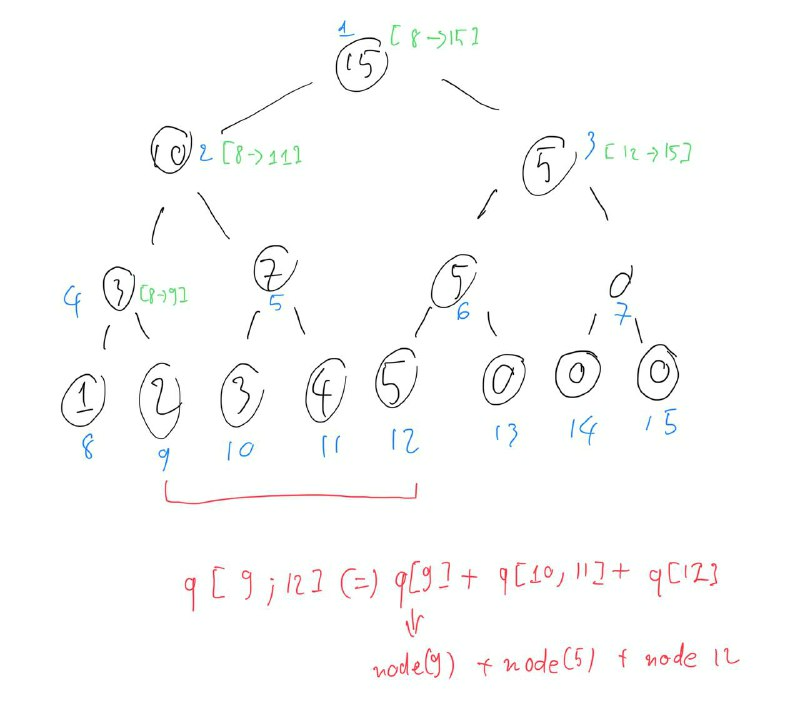

# Intuition

- This question belong to a set of problems called range query, which are usually solved by prefix sum, Binary indexed tree (Fenwick tree) or Segment Tree.
- This question can be trivialized by implementing Fenwick or segment tree, knowing those data structures is highly recommended.

## Approach

### Segment Tree

#### Characteristics

- Segment tree is a binary tree used for storing the intervals or segment of an array, this allow it to answer a range query of associative operations (sum, multiply, min/max... in a range) efficiently.
- The following image is a visualized segment tree, in which:
  - Blue text is the index of that node (we implement the tree from index 1 to trivialize the finding child node equation)
  - Green text is the range for which the current node is the sum of
  - Red is the query range we need answer of



- The segment tree are kind of similar to a heap tree, in which we build it on an array instead of a dedicated tree with pointers and nodes. Similar to a heap tree, we can find the child nodes from root using the following equations **`left-child-index = root-index*2`** and **`right-child-index = root-index*2+1`**
- In this question, we calculate the sum of child nodes and save it into their roots, a leaf node's value is the value of the input array itself.
- **Node:**
  - The segment tree we implement this time start with index 1 with length of 2*n in which n is the next power of 2 >= input array length, this length helps us trivialize the equation for finding child index from current root, and makes root nodes re-computation easier to code/handle. You can either find the next power of 2 to optimize space (or just multiply current n with 4, it's guaranteed to work).
  - In the image above the length of the segment tree is an array of 16 elements4, starting from index 1. The original array's elements are stored from index [n, 2*n-1], if the input elements are not enough the rest of the leaf nodes are filled with either 0 or MIN/MAX values depend on the question.

#### Building the tree

- Because our implementation relies on the following two equations **`left-child-index = root-index*2`** and **`right-child-index = root-index*2+1`**, our tree's length need to be of power of 2. First we need to define the length of the tree, this can be done by find the **next power of 2 >= input array length, then double it**. This is a sub problem and there are multiple way we do this, if this current implementation is difficult to understand you can use your own solution.
- Let `n` be the length of the input array, we can find **next power of 2 >= 2** by checking the count of set bits of `n` and increase n until the count is 1 (see [characteristic of power of 2 in binary form](https://en.wikipedia.org/wiki/Power_of_two#:~:text=power%20of%20two.-,Base%20of%20the%20binary%20numeral%20system,-%5Bedit%5D)). You can use the `__builtin_popcount` function or implement your own.

```cpp
// increase n to be equal to its next power of 2
while(count_setb(n) != 1) {
    nums.push_back(0); // pad with 0 or INFINITY, base on your query requirements
    n++;
}
```

- After that we start filling leaf nodes with input arrays, the leaf nodes index will start from n:

```cpp
    // populate leaf nodes with input elements
    for(int i = 0; i < n; i++) {
        tree[i+n] = nums[i];
    }
```

- Next we build the parent nodes, which contains sum of its two left+right child nodes:

```cpp
for(int i = n-1; i > 0; i--) {
    /*
        tree[i] is parent
        tree[i*2] is child left
        tree[i*2+1] is child left
    */
    tree[i] = tree[i*2] + tree[i*2+1];
}
```

#### Update the segment tree

- Segment tree supports both range update and range query in O(logn) times, there is 2 way to implement update function, either by linear or recursion. This implementation is implemented in linear for simplicity sake, but keep in mind that you can do the update in recursion.
- We did quite a bit of work when building the tree, so that our update can be easier to implement. You can do update function in 2 way, iterative and recursive.

```cpp
// iterative version
void update(int index, int val) {
    index += n;
    tree[index] = val;
    index /= 2;
    while(index > 0) {
        //`left-child-index = root-index*2` and `right-child-index = root-index*2+1`
        tree[index] = tree[index*2] + tree[index*2+1];
        index /= 2;
    }
}
```

#### Query the segment tree

- In the query function, we will implement the range query, doing range query iteratively is doable but not flexible enough so we will only implement query with recursive
- The query (and recursive update) function relies on the fact that a root node is made of the result of its childrens's associative function, in which for this problem is the sum of the childrens, so along with the root node index, we use 2 other variables to determine the range for which this current node is made of:
  - Our input array index range from n to tree.size()-1, our root node range from index 1 to n-1.
  - Our root node tree[1] is **sum of nodes in range [n, tree.size()-1]**, but also tree[1] = tree[2] + tree[3].
  - tree[2] is **sum of nodes in range [n, (tree.size()-1)/2]** but also tree[2] = tree[4] + tree[5]
  - The ideal is that we can quickly find the sum of range [x,y] if we traverse the segment tree from index 1 and go downward. Using the query range and the current node, **so if tree[i] is sum of node [j,k] then we can use left = j, right = k and compare it with our query range.**

```cpp
// tree[index] is the sum of nodes from range [left, right]
// range_l, range_r is the query range from the problem
int query(int index, int left, int right, int range_l, int range_r) {
    bool out_bound = left > rangr_r || right < range_l;
    // if the current node is out of bound, no need to go further
    if(out_bound) return 0; // you might need to return infinity base on your question

    if(left >= range_l && right <= range_r) {
        // this is leaf node
        return tree[index];
    }

    int mid = left + (right-left)/2;

    // move down left
    update(index*2, val, left, mid, range_l, range_r);
    // move down right
    update(index*2, val, mid+1, right, range_l, range_r);
    
    // if not leaf, it is either out of range and/or poped-back into parent
    // update parent
    tree[index] = tree[index*2] + tree[index*2+1];
}
```

- The recursive update follows the same principles:

```c++
// recursive version
void update(int index, int val, int left, int right, int range_l, int range_r) {
    bool out_bound = left > rangr_r || right < range_l;
    if(out_bound) return;
    // in update range
    if(left >= range_l && right <= range_r) {
        // this is leaf node
        tree[index] = val // update node val = new val
        // tree[index] += val // update node val += new val
        return;
    }

    int mid = left + (right-left)/2;
    // move down left
    update(index*2, val, left, mid, range_l, range_r);
    // move down right
    update(index*2, val, mid+1, right, range_l, range_r);
    
    // if not leaf, it is either out of range and/or poped-back into parent
    // update parent
    tree[index] = tree[index*2] + tree[index*2+1];
}
```

- You can even combine the query and update into 1 super function, I recommend you try doing it yourself.

## Complexity

- **Time complexity**:
  - *Build tree*: $O(n)$ as we use 2 for loop to build the tree.
  - *Query&update*: $O(logn)$ the query is similar to a binary search, where at each time we going down the tree, the recursion queries are cut down by half.
- **Space complexity**: $O(n)$ the length of the segment tree is twice the next power of 2 >= n, with n is the length of input array.

## Code

```cpp

class NumArray {
public:

    vector<int> tree;
    int n;

    NumArray(vector<int>& nums) {
        n = nums.size();

        while(count_setb(n) != 1) {
            nums.push_back(0);
            n++;
        }

        for(int i = 0; i < 2*n; i++) tree.push_back(0);

        for(int i = 0; i < n; i++) {
            tree[i+n] = nums[i];
        }

        for(int i = n-1; i > 0; i--) {
            tree[i] = tree[i*2] + tree[i*2+1];
        }
    }

    int count_setb(int n) {
        int count = 0;
        while(n > 0) {
            count += n&1;
            n >>= 1;
        }
        return count;
    }

    int query(int index, int left, int right, int range_l, int range_r, vector<int> &tree) {
        bool out_bound = left > range_r || right < range_l;
        if(out_bound) return 0;
        if(left >= range_l && right <= range_r) {
            return tree[index];
        }
        int mid = left + (right-left)/2;
        return query(index*2, left, mid, range_l, range_r, tree) + query(index*2+1, mid+1, right, range_l, range_r, tree);
    }
    
    void update(int index, int val) {
        index += n;
        tree[index] = val;
        index /= 2;
        while(index > 0) {
            tree[index] = tree[index*2] + tree[index*2+1];
            index /= 2;
        }
    }
    
    int sumRange(int left, int right) {
        return query(1, n, tree.size()-1, left+n, right+n, tree);
    }
};
```
